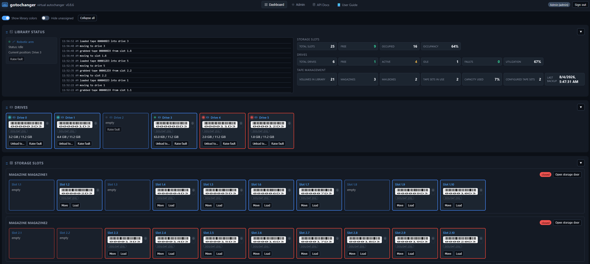

# gotochanger


[](https://github.com/swenske/gotochanger/actions/workflows/ci.yml)
[](https://github.com/swenske/gotochanger/releases)
[](https://swenske.github.io/gotochanger/)
[](https://github.com/swenske/gotochanger)
[](https://hub.docker.com/r/swenske/gotochanger)
[](https://github.com/swenske/gotochanger/stargazers)
[](LICENSE)
[](go.mod)

A fake SCSI tape autochanger (virtual library) simulator for testing backup
software against something that behaves like a real tape library — storage
slots, I/O ("mail slot") elements, multiple drives, volumes, robot moves,
and SNMP traps — without any real tape hardware.

It is meant as a drop-in, much more capable replacement for Bareos's
`disk-changer.in`, adding I/O slots, a REST API, a management web UI, and
SNMP notifications, while remaining compatible with existing
`Device Type = File` Bareos configurations. An optional second backend
can also expose the same library as real kernel SCSI devices (`/dev/sg*`,
`/dev/nst*`) via TCMU/LIO, for deployments that need Bareos to see an
actual SCSI changer rather than a changer-script convention — see
"Kernel mode: real SCSI devices" below.



## Components

| Binary                 | Purpose                                                                                |
| ---------------------- | -------------------------------------------------------------------------------------- |
| `gotochangerd`         | The daemon: library state, REST API, embedded web UI, SNMP traps, setup wizard.        |
| `gotochanger-changer`  | Drop-in replacement for Bareos's `disk-changer.in` "Changer Command".                  |
| `gotochangerctl`       | General purpose admin CLI (status, load/unload/move, volumes, backup/restore, tokens). |
| `gotochanger-tcmud`    | Optional kernel-mode backend (ships in the separate `gotochanger-kernel` package): exposes the same library as real SCSI devices (`/dev/sg*`, `/dev/nst*`) via TCMU/LIO, translating real SCSI CDBs into the same calls `gotochanger-changer` makes over the trusted socket. |

## Concepts

Modeled after SCSI Medium Changer (SMC) element types:

- **Storage slots** — home locations for cartridges (`slot`), addressed
  `1..slots`.
- **I/O slots** (`ioslot`) — "mail slots" used to physically load/pickup
  media through door-gated operator actions.
  Addressed contiguously right after the storage slots (e.g. slots 1..20
  followed by I/O slots 21..24) exactly like a real SCSI medium changer and
  mtx/mtx-changer's "N Slots (M Import/Export)" convention — not a
  separate address space starting back at 1. This matters for Bareos,
  which learns the *total* addressable element count from the changer's
  `slots` command and maps individual addresses to regular or
  import/export slots solely by which range they fall in. gotochangerctl
  and the web UI display a human-facing, magazine/mailbox-relative label
  instead of the raw address where available (e.g. `2.3` for slot 3 of the
  2nd currently-existing magazine).
- **Mailboxes** — named, independently addressable groups of I/O slots
  (1-5 slots each), the I/O-slot equivalent of a magazine. I/O slots
  aren't configured as a flat count; they belong to a mailbox, and logical
  libraries assign whole mailboxes (by ID), not individual I/O slot
  addresses. A mailbox can optionally require a 4-digit PIN to open its
  door.
- **Magazines** — named, independently addressable groups of storage slots
  (5-20 slots, in increments of 5). Like mailboxes, a magazine can
  optionally require a 4-digit PIN to open its storage door; no PIN
  configured means the door opens freely.
- **Drives** (`drive`) — data transfer elements. Loading a drive symlinks
  its configured device path (Bareos's "Archive Device") to the volume's
  backing file, exactly like `disk-changer.in` did (in userspace/file
  mode — see "Kernel mode" below for the alternative). Drives track
  mounts-since-cleaning and can be faulted individually; a separate
  **robotic fault** (`blocked_arm`, `mispositioned_cartridge`,
  `pickup_failure`, `drop_failure`, `movement_jam`, `other`) targets the
  single shared arm instead, blocking *all* Load/Unload/Move until
  cleared — there's only one robot.
- **Volumes** are plain files stored under their tape set's own storage
  folder (see "Tape sets" below), growable up to a configured capacity;
  once a loaded volume's file reaches that capacity it is marked full and
  made read-only, simulating end-of-tape. A volume can
  also be individually write-protected (simulating a physical write-protect
  tab), and can be sent to and recalled from an offsite vault, either
  manually or on an automatic rotation schedule.
- **Cleaning tapes** — a special volume kind with a limited usage count
  that decrements each cleaning cycle and expires once exhausted; cleaning
  behavior (mount threshold, max uses) is configurable per library.
- **Logical libraries** — a named partition of the physical library (like a
  Dell ML3), each with its own subset of drives/magazines/mailboxes and a
  color for the dashboard. `Load`/`Unload`/`Move` reject any element
  outside the logical library named in the `X-Logical-Library` header (or
  `gotochanger-changer --logical-library=NAME` / `gotochangerctl
  --logical-library`); an element can belong to at most one logical
  library at a time.
- **Tape sets** — named groups of cartridges by tape/media type (LTOx,
  DDSx, DLTxxxx — tracked separately from drive hardware types), each
  stored under its own folder on disk. Cartridge barcodes can be
  auto-generated per set for LTO, DLT, SDLT, DDS/DAT, AIT/SAIT, and IBM
  3592 conventions, plus a generic fallback for custom formats.

Library topology (a VTL name, drive/tape types, magazines, mailboxes,
drive devices, logical libraries, tape sets) lives in a SQLite database at
`<data_dir>/state.db`, populated by the setup wizard or the Admin API —
**not** in `config.yaml`, which only holds service-level settings
(data dir, listeners, SNMP, poll interval, log level). A fresh install has
no drives, magazines, or mailboxes configured at all until the wizard runs.

## Quick start

```sh
sudo apt install ./gotochanger_<version>_amd64.deb
sudo systemctl status gotochanger
journalctl -u gotochanger | grep 'bootstrap API token'   # save this token!
```

Open the web UI at `http://<gotochanger-host>:8480/`. On first visit you'll be asked
to set a password for the built-in **Admin** account (username `Admin`),
then — since a fresh install starts with nothing configured — you'll be
guided through the setup wizard to name your VTL and create your drives,
magazines, mailboxes, an optional offsite location, tape sets (optionally
auto-generating N labeled cartridges per set), at least one logical
library, and a latency profile. Finishing the wizard applies the new
topology to the running daemon immediately, no restart needed.
From there, use the **Admin** section to manage users/tokens, the drive/tape
type catalogs, tape sets, drives, magazines, mailboxes, logical libraries,
and backups; or drive everything from the CLI:

```sh
# gotochangerctl talks to the trusted local Unix socket by default, no token needed
# example below assumes 20 storage slots and 4 I/O slots addressed as 21..24, and a
# tape set named "Set1" already created (e.g. by the setup wizard)
gotochangerctl status
gotochangerctl tape-set add-tape Set1 Vol0001       # create a tape outside the library
gotochangerctl io-door 1 open                       # open mailbox 1's mail slot door
gotochangerctl io-door 1 close '[{"action":"load","address":21,"barcode":"Vol0001"}]'
gotochangerctl move ioslot 21 slot 1                # robot move inside the library
gotochangerctl load slot 1 0                        # load slot 1 into drive 0
gotochangerctl unload 0 slot 1                      # unload drive 0 back to slot 1
gotochangerctl events
```

## Users, roles and API tokens

The web UI is protected by username/password sessions; the REST API also
accepts scoped API tokens (for scripts/automation) or is reachable
unauthenticated over the trusted local Unix socket (used by
`gotochanger-changer`/`gotochangerctl` for Bareos integration).

Three roles, in increasing order of privilege:

| Role       | Can do                                                                                                |
| ---------- | ----------------------------------------------------------------------------------------------------- |
| `viewer`   | Read-only: status, events, volumes list                                                               |
| `operator` | Everything a viewer can, plus load/unload/move/door operations/outside tape create-delete/drive fault |
| `admin`    | Everything, plus the Admin section: users, tokens, settings                                           |

The built-in `Admin` account must have its password set on first visit to
the web UI (enforced password policy: 12+ characters, at least 3 of
lowercase/uppercase/digit/special character, not the username, not a common
password; accounts lock out for 15 minutes after 5 failed attempts).

From the **Admin** section (admin role required) you can:

- **Users**: create accounts (username + role + initial password, which
  must be changed at next login), change roles, reset passwords, delete
  accounts (the last remaining admin cannot be demoted or deleted).
- **API Tokens**: create/revoke tokens scoped to a role, used by scripts
  via the `X-Api-Key` header or `Authorization: Bearer <token>`.
- **Drive Types** / **Tape Types**: manage the suggested catalogs (add,
  update, remove). Drive Types seeds LTO-8, LTO-9, DDS, DLT, SDLT, AIT,
  3592, and an Unlimited capacity/performance model on first start; Tape
  Types seeds a larger, generation-specific catalog (`LTO-1`..`LTO-9`,
  `DLT-III`/`DLT-IV`, `SDLT-220`/`SDLT-600`, `DDS-1`..`DDS-4`,
  `DAT-72`/`160`/`320`, `AIT-1`..`AIT-4`, `SAIT-1`, `IBM-3592`, and
  `Unlimited`).
- **Drives**: create/edit/remove drives (device path + drive-type
  assignment). Changes hot-apply immediately — no restart needed. Deleting
  a drive that currently holds a volume is refused.
- **Tape Sets**: create/edit/delete named groups of cartridges by tape
  type, each with its own storage folder.
- **Magazines**: create/edit/delete slot groups (5-20 slots, in increments
  of 5), optionally PIN-protected. Changes hot-apply immediately — no
  restart needed. Deleting a magazine that still has volumes in its slots
  is refused.
- **Mailboxes**: create/edit/delete I/O slot groups (1-5 slots each),
  the I/O-slot equivalent of a magazine, optionally PIN-protected. Changes
  hot-apply immediately. Deleting a mailbox that still has volumes in its
  slots is refused.
- **Logical Libraries**: create/edit/delete named partitions of the
  library, assigning drives/magazines/mailboxes and a display color. An
  element can only belong to one logical library at a time (rejected with
  409 otherwise); unassigned drives/slots/mailboxes are listed in the same
  screen for reassignment.
- **Backup & Restore**: download an on-demand backup, configure a
  recurring scheduled backup with a retention count, browse/download/
  delete previously stored backups, restore from a backup file (requires
  a service restart to apply — and **replaces user accounts and API
  tokens along with topology**, since auth lives in the same database),
  or factory-reset the whole install (gated on typing the VTL's current
  name to confirm, with an option to also delete volume files on disk).
- **Settings**: view/change the parts of configuration that can safely
  apply without a restart (default volume capacity, barcodes, poll
  interval, log level, SNMP, latency profile, cleaning thresholds, the
  magazine/mailbox door PIN, offsite rotation schedule, and the
  userspace/kernel operational mode). Only `data_dir` and `listen` require
  editing `/etc/gotochanger/config.yaml` plus
  `systemctl restart gotochanger`.

Equivalent CLI commands (`gotochangerctl`, talking to the trusted socket by
default so no token/login is needed locally):

```sh
gotochangerctl user new op1 operator 'Op3rat0r$InitialPass1'
gotochangerctl user list
gotochangerctl user role op1 viewer
gotochangerctl user reset-password op1 'N3wPassword$Here'
gotochangerctl token new ci-bot operator
gotochangerctl token list
gotochangerctl settings get
gotochangerctl settings set poll_interval=10s log_level=debug

gotochangerctl drive-type new LTO-10 500MB/s 24TB "LTO-10 tape drive"
gotochangerctl tape-type list
gotochangerctl tape-set new Archive2026 LTO-9 /var/lib/gotochanger/tapesets/Archive2026
gotochangerctl magazine new Magazine3 10
gotochangerctl mailbox new Mailbox2 3
gotochangerctl logical-library new Library2 "" "" ""   # empty CSVs = no elements yet
gotochangerctl logical-library update Library2 '#FF8800' 2,3 Magazine3 Mailbox2
gotochangerctl unassigned
gotochangerctl offsite send slot 4
gotochangerctl offsite recall Vol0004 slot 4
gotochangerctl wizard status

gotochangerctl backup download ./gotochanger-backup.db
gotochangerctl backup list
gotochangerctl backup schedule set interval=24h retention=7
gotochangerctl restore ./gotochanger-backup.db     # requires a service restart to apply
gotochangerctl reset MyVTL --delete-volumes         # factory reset, gated on the VTL's name
```

## Bareos integration

Point Bareos's Device resource at the changer shim exactly like
`disk-changer.in`, and set `Device Type = File` with `Archive Device`
matching the corresponding entry in `library.drive_devices` in
`/etc/gotochanger/config.yaml`:

```text
Autochanger {
  Name = FakeML3
  Device = Drive0, Drive1
  Changer Device = /dev/null              # unused, kept for compatibility
  Changer Command = "/usr/bin/gotochanger-changer %c %o %S %a %d %V"
}

Device {
  Name = Drive0
  Drive Index = 0                         # required with 2+ drives - see below
  Media Type = File
  Archive Device = /var/lib/gotochanger/drives/drive0
  Device Type = File
  AutomaticMount = yes
  RemovableMedia = yes
  AutoChanger = yes
}

Device {
  Name = Drive1
  Drive Index = 1
  Media Type = File
  Archive Device = /var/lib/gotochanger/drives/drive1
  Device Type = File
  AutomaticMount = yes
  RemovableMedia = yes
  AutoChanger = yes
}
```

`Drive Index` defaults to `0` for any Device resource that doesn't set it
explicitly - with only one drive that's harmless, but with two or more it
means every drive silently collapses to "drive 0" from Bareos's point of
view (regardless of the Device's `Name`/`Archive Device`), so it's
required as soon as an Autochanger has more than one Device. Set it to
the drive's 0-based position within *this* Autochanger's own `Device =`
list, not gotochangerd's own drive index (they happen to match here only
because both start at 0 and are contiguous). The Admin UI's Logical
Libraries "Bareos Config" button generates this correctly, including
`Drive Index`, for whatever drives are actually assigned to that logical
library.

Add the `bareos` system user to the `gotochanger` group so it can reach the
trusted local socket and read/write volume files:

```sh
sudo adduser bareos gotochanger
```

Supported changer commands (matching `disk-changer.in`): `load`, `unload`,
`list`, `listall`, `slots`, `loaded`, `transfer`. Extra commands usable by
hand (never invoked by Bareos itself): `outside`, `outside-delete`,
`io-door`, `storage-door`, `ioslots`, `offsite-send`, `offsite-recall`.

### Scoping an Autochanger to one logical library

If the physical library is partitioned into multiple logical libraries,
add a static `--logical-library=NAME` flag to that Autochanger resource's
`Changer Command` line (Bareos has no substitution variable for this, so
it's a fixed per-Autochanger suffix — the Autochanger is already
permanently bound to one logical library):

```bash
Changer Command = "/usr/bin/gotochanger-changer %c %o %S %a %d %V --logical-library=Library1"
```

With this set, `load`/`unload`/`move` (and their `X-Logical-Library`
REST/CLI equivalents) are rejected with an error if the addressed slot,
I/O slot, or drive doesn't belong to `Library1` — this is what keeps two
Bareos Autochangers sharing one physical gotochanger instance from
touching each other's media.

### Kernel mode: real SCSI devices

By default gotochanger runs in **userspace/file mode**: loading a drive
symlinks a plain file at the configured `Archive Device` path, no root or
kernel modules required. An optional **kernel mode** instead exposes the
same library as real SCSI devices (`/dev/sg*` for the changer/generic
device, `/dev/nst*` for tape drives) via TCMU/LIO, for tools that insist
on talking to an actual SCSI medium changer rather than a changer-script
convention — no real tape hardware is involved either way, kernel mode
just adds a real *kernel device node* backed by the same plain files.

1. Install the separate `gotochanger-kernel` package (depends on
   `gotochanger` and `polkitd`). It needs root and the `target_core_user`
   kernel module — the package's postinst does a best-effort `modprobe`.
2. Turn it on by setting the **operational mode** to `kernel` (setup
   wizard, or Admin → Settings / `gotochangerctl settings set
   operational_mode=kernel`). gotochangerd's own reconciler then
   automatically starts/stops one `gotochanger-tcmud@<logical-library-
   name>.service` instance per logical library (`@default` if the
   library is unscoped) via polkit-authorized systemd calls — no manual
   `systemctl enable` step is required, though it's supported (the Admin
   UI's per-library "Kernel Mode Setup" dialog shows the equivalent
   manual `systemctl enable --now gotochanger-tcmud@<instance>` command
   for cases where automatic management isn't wanted).
3. Real devices then appear under `/dev/sg*`/`/dev/nst*`. Prefer the
   stable `/dev/tape/by-id/scsi-<NAA>[-nst]` symlinks over raw
   `/dev/sgN`/`/dev/nstN` numbers, which are **not** stable across a
   `gotochanger-tcmud` restart. Admin → Drives and the Bareos-Config
   generator button both show the actual current device paths.
4. Point Bareos's `Archive Device`/`Changer Device` at those real device
   paths instead of the file-based ones — no other config-file syntax
   change is needed.

Device paths are tracked in memory on the gotochangerd side (a running
`gotochanger-tcmud` self-reports them at startup) and are lost on a
gotochangerd restart until the `gotochanger-tcmud` instance itself
restarts.

## REST API

All actions are available over HTTP. The Unix socket
(`/run/gotochanger/gotochanger.sock`) is trusted (every request is treated
as an admin, access controlled by filesystem permissions); the TCP
listener accepts either a browser session cookie or an API token
(`X-Api-Key` header or `Authorization: Bearer <token>`), each carrying one
of the `admin`/`operator`/`viewer` roles described above.

| Method | Path | Role | Purpose |
| ------ | ------------------------------ | --------- | --------------------------------- |
| POST | `/api/v1/auth/bootstrap` | none | Set the initial Admin password |
| POST | `/api/v1/auth/login` | none | Log in, start a session |
| POST | `/api/v1/auth/logout` | viewer+ | Log out |
| GET | `/api/v1/auth/state` | none | Am I logged in? Is bootstrap needed? |
| POST | `/api/v1/auth/change-password` | viewer+ | Change your own password |
| GET | `/api/v1/status` | viewer+ | Full library snapshot |
| GET | `/api/v1/events` | viewer+ | Recent activity log |
| GET | `/api/v1/stream` | viewer+ | Live event stream (Server-Sent Events) |
| GET | `/api/v1/volumes` | viewer+ | List all volumes |
| GET | `/api/v1/outside` | viewer+ | List outside-library tapes |
| POST | `/api/v1/outside` | operator+ | Create outside-library tape |
| DELETE | `/api/v1/outside/{label}` | operator+ | Delete outside-library tape |
| GET | `/api/v1/cleaning/tapes` | viewer+ | List cleaning tapes and remaining uses |
| POST | `/api/v1/cleaning/tapes` | operator+ | Create a cleaning tape |
| POST | `/api/v1/load` | operator+ | Load a slot/ioslot into a drive |
| POST | `/api/v1/unload` | operator+ | Unload a drive to a slot/ioslot |
| POST | `/api/v1/move` | operator+ | Move between slot/ioslot elements |
| POST | `/api/v1/doors/io/open` | operator+ | Open I/O door |
| POST | `/api/v1/doors/io/close` | operator+ | Close I/O door and process actions |
| POST | `/api/v1/doors/storage/open` | operator+ | Open storage door |
| POST | `/api/v1/doors/storage/close` | operator+ | Close storage door and process actions |
| POST | `/api/v1/drives/{index}/fault` | operator+ | Inject/clear a simulated fault on one drive |
| POST | `/api/v1/robotics/fault` | operator+ | Inject/clear a simulated fault on the shared robotic arm (blocks all Load/Unload/Move) |
| POST | `/api/v1/volumes/{barcode}/write-protect` | operator+ | Set/clear a volume's write-protect flag |
| GET/POST/DELETE | `/api/v1/users` | admin | Manage user accounts |
| GET/POST/DELETE | `/api/v1/tokens` | admin | Manage scoped API tokens |
| GET/PUT | `/api/v1/settings` | admin | View/update application settings |
| GET/PUT | `/api/v1/settings/latency` | admin | View/update latency simulation settings |
| GET/PUT | `/api/v1/settings/cleaning` | admin | View/update cleaning thresholds |
| GET/PUT | `/api/v1/settings/pin` | admin | View/update the magazine/mailbox door PIN |
| GET/PUT | `/api/v1/settings/prometheus` | admin | View/update whether the Prometheus exporter is enabled |
| GET | `/api/v1/prometheus/dashboard` | admin | Download the pre-built Grafana dashboard JSON |
| GET | `/api/v1/backup/download` | admin | Download an on-demand backup of `state.db` |
| GET/PUT | `/api/v1/backup/schedule` | admin | View/update the recurring backup schedule |
| GET | `/api/v1/backups` | admin | List stored (scheduled) backups |
| GET | `/api/v1/backups/{filename}/download` | admin | Download a stored backup |
| DELETE | `/api/v1/backups/{filename}` | admin | Delete a stored backup |
| POST | `/api/v1/restore` | admin | Restore `state.db` from a backup file (requires restart) |
| POST | `/api/v1/reset` | admin | Factory reset (name-confirmed) |
| GET | `/api/v1/wizard` | none | Current setup wizard state |
| POST | `/api/v1/wizard` | none | Submit one wizard step (persists immediately) |
| POST | `/api/v1/wizard/complete` | none | Finish the wizard, hot-apply topology |
| POST | `/api/v1/wizard/reset` | none | Reset wizard progress |
| GET | `/api/v1/wizard/options` | none | Catalogs + current state for the wizard UI |
| GET/POST/PUT/DELETE | `/api/v1/logical-libraries[/{name}]` | admin | Manage logical library partitions |
| GET | `/api/v1/unassigned` | admin | Drives/slots/mailboxes in no logical library |
| GET/POST/PUT/DELETE | `/api/v1/drive-types[/{name}]` | admin | Manage the drive-type catalog |
| GET/POST/PUT/DELETE | `/api/v1/drives[/{index}]` | admin | Manage drives (device path + drive-type assignment, hot-applies) |
| GET/POST/PUT/DELETE | `/api/v1/tape-types[/{name}]` | admin | Manage the tape/media-type catalog |
| GET/POST/PUT/DELETE | `/api/v1/tape-sets[/{name}]` | admin | Manage tape sets (type + storage folder) |
| GET | `/api/v1/fs/browse` | admin | Browse server-side folders (tape-set storage picker) |
| GET/POST/PUT/DELETE | `/api/v1/magazines[/{id}]` | admin | Manage magazines (hot-applies) |
| GET/POST/PUT/DELETE | `/api/v1/mailboxes[/{id}]` | admin | Manage mailboxes (hot-applies) |
| GET | `/api/v1/offsite` | viewer+ | List volumes in the offsite vault |
| POST | `/api/v1/offsite/send` | operator+ | Send a volume to the offsite vault |
| POST | `/api/v1/offsite/recall` | operator+ | Recall a volume from the offsite vault |
| GET | `/api/v1/kernel-mode/status` | viewer+ | Whether the `gotochanger-kernel` package/kernel module are available |
| GET | `/api/v1/kernel-mode/devices` | viewer+ | Real device paths self-reported by running `gotochanger-tcmud` instances |
| POST/DELETE | `/api/v1/kernel-mode/devices/{instance}` | operator+ | Used by `gotochanger-tcmud` itself to report/clear its devices |

`Load`/`Unload`/`Move` (and `GET /api/v1/status`) additionally accept an
`X-Logical-Library: NAME` header to scope the operation to one logical
library — see "Scoping an Autochanger to one logical library" above.

### Interactive API docs (Swagger UI) and User Guide

A full OpenAPI 3.0 spec is served at `/api/v1/openapi.json` and rendered
as an interactive, embedded Swagger UI at **`/docs`** (linked from the web
UI's nav bar). An embedded, self-contained **User Guide** is also served
at **`/guide`**, linked from the same nav bar and opening in a new tab.
Neither requires internet access to view: both the Swagger UI assets and
the guide are vendored and embedded in the binary. Use the "Authorize"
button with an API token, or just stay logged into the web UI in the same
browser (the session cookie is sent automatically for same-origin
requests). The same guide is also published at
[swenske.github.io/gotochanger](https://swenske.github.io/gotochanger/)
for browsing without a running `gotochangerd`.

## SNMP traps

Disabled by default. Like the rest of the daemon's configuration (see
"Concepts" above), SNMP settings live in the database and are edited
live, with no config file and no restart:

- Web UI: Admin -> Settings -> "SNMP traps" panel (Enabled, Enterprise
  OID, Agent address, and Targets - one per line, `host:port:community`).
- CLI, for the scalar fields:

  ```sh
  gotochangerctl settings set snmp_enabled=true snmp_enterprise_oid=1.3.6.1.4.1.55555.1
  ```

  Targets are a list, which the CLI's simple `key=value` form can't
  express - set them via the web UI, or with a direct
  `PUT /api/v1/settings` call (`snmp_targets`, an array of
  `{host, port, community}`).

Every state-changing action emits:

- one activity-log event exposed via `/api/v1/events`;
- one SNMPv2c trap (when SNMP is enabled).

This includes both success and failure outcomes for robotics/media actions,
authentication actions (login/logout/bootstrap/password change), and
configuration actions (users/tokens/settings).

Events now use a structured code taxonomy inspired by enterprise tape-library
MIB conventions, for example:

- `ROBOTICS.LOAD.SUCCESS`
- `ROBOTICS.MOVE.FAILURE`
- `DRIVE.FAULT.SET.SUCCESS`
- `AUTH.LOGIN.FAILURE`
- `CONFIG.SETTINGS.UPDATE.SUCCESS`

Each event also carries `category`, `severity`, `outcome`, `operation`, and
`detail` fields so operators and NMS rules can classify behavior without
parsing free-text messages.

A dynamic MIB is served by the daemon at `/api/v1/snmp/mib` (viewer+ auth)
and is also linked from the web UI's Admin -> Settings -> SNMP traps panel.
The endpoint renders the MIB using the currently configured
`snmp.enterprise_oid`, so receivers decode the exact OIDs currently emitted.

### Event code quick reference

| Domain | Code prefix | Typical severity |
| ------ | ----------- | ---------------- |
| Robotics/media movement | `ROBOTICS.*`, `MEDIA.*` | `information` / `warning` |
| Drive state | `DRIVE.*` | `information` / `error` |
| Authentication | `AUTH.*` | `information` / `error` |
| Configuration/admin | `CONFIG.*` | `configuration` / `error` |
| Internal daemon failures | `SYSTEM.*` | `error` |

Outcome suffix convention:

- `*.SUCCESS` for completed actions
- `*.FAILURE` for rejected/failed actions
- `*.WARNING` for non-fatal alerts (for example simulated end-of-tape)

## Prometheus metrics

Disabled by default, like SNMP. Enable it from the Admin panel or the CLI:

- Web UI: Admin -> Settings -> "Prometheus" panel (Enable checkbox, current
  status, and a "Download Grafana dashboard" button).
- CLI: `gotochangerctl prometheus enable` / `disable` / `status`.

Once enabled, `GET /metrics` serves metrics in the standard Prometheus text
exposition format. **This endpoint is intentionally unauthenticated** —
matching standard Prometheus scrape practice, and reachable even on the
authenticated TCP listener with no session cookie or API token — so
restrict network access to it (firewall, reverse proxy, or scrape-only
security group) if this daemon is reachable beyond trusted monitoring
infrastructure. It exposes slot/volume/tape-set naming and library
topology to anyone who can reach it, even though it never exposes
credentials.

Example Prometheus scrape config:

```yaml
scrape_configs:
  - job_name: 'gotochanger'
    static_configs:
      - targets: ['localhost:8480']  # adjust host:port to your listen address
```

### Metrics reference

| Metric | Type | Labels | Description |
| ------ | ---- | ------ | ------------ |
| `gotochanger_slots_total` | gauge | | Total storage slots |
| `gotochanger_slots_free` | gauge | | Free storage slots |
| `gotochanger_slots_occupied` | gauge | | Occupied storage slots |
| `gotochanger_readers_total` | gauge | | Total tape drives |
| `gotochanger_readers_idle` | gauge | | Drives loaded but not currently reading/writing |
| `gotochanger_readers_active` | gauge | | Drives currently reading or writing |
| `gotochanger_readers_free` | gauge | | Drives with no volume loaded |
| `gotochanger_readers_error` | gauge | | Drives in a simulated fault state |
| `gotochanger_volumes_total` | gauge | | Total tape volumes known to the library |
| `gotochanger_volumes_by_status` | gauge | `status` (`in_slot`, `in_ioslot`, `in_drive`, `outside`, `offsite`) | Volumes by current location |
| `gotochanger_magazines_total` | gauge | | Total storage magazines |
| `gotochanger_capacity_utilization_percent` | gauge | | Occupied storage slots as a percentage of total |
| `gotochanger_queue_depth` | gauge | | 1 if the single robotic arm is currently busy, 0 if idle — this simulator has one arm and no operation queue |
| `gotochanger_uptime_seconds` | gauge | | Seconds since the daemon started |
| `gotochanger_last_backup_timestamp` | gauge | | Unix timestamp of the last configuration backup (Admin > Backup, a `state.db` snapshot) — 0 if none has ever been taken. Not a Bareos backup-job signal; this daemon only models the changer/library, not Bareos jobs |
| `gotochanger_operations_total` | counter | `operation_type` (`load`, `unload`, `move`, `door_open`, `door_close`, `offsite_send`, `offsite_recall`) | Total library operations executed, whether they succeeded or failed |
| `gotochanger_operation_duration_seconds` | histogram | `operation_type` | Library operation latency in seconds |
| `gotochanger_errors_total` | counter | `error_type` (`bad_request`, `unauthorized`, `forbidden`, `not_found`, `conflict`, `internal`, `other`) | Total request errors, bucketed by HTTP status class |

Metrics are recorded regardless of transport: both the authenticated TCP
API and the trusted Unix socket (used by `gotochanger-changer`/
`gotochangerctl`/`gotochanger-tcmud` — i.e. how Bareos actually drives this
daemon) share the same routing, so `gotochanger_operations_total` reflects
real Bareos-driven activity, not just direct API calls.

### Grafana dashboard

A ready-to-import dashboard (Overview, Storage Capacity, Reader Status,
Tape Inventory, Operations Timeline, and System Health rows, with
threshold-based coloring on capacity/error-rate panels) is available from
Admin -> Settings -> Prometheus -> "Download Grafana dashboard", or via
`GET /api/v1/prometheus/dashboard` / `gotochangerctl prometheus dashboard
gotochanger-dashboard.json`. To import it: in Grafana, Dashboards -> New ->
Import -> upload `gotochanger-dashboard.json`, then select a Prometheus
data source scraping this daemon's `/metrics` endpoint when prompted.

## Install from repository

Pre-built `.deb` packages (`gotochanger` and the optional
`gotochanger-kernel` add-on) are published to an apt repository after
every release:

```sh
# 1. Import the repository's signing key
sudo install -d -m 0755 /etc/apt/keyrings
curl -fsSL https://apt.sw-servers.net/apt-sw-servers.net.gpg.asc \
  | sudo gpg --dearmor -o /etc/apt/keyrings/apt-sw-servers.net.gpg

# 2. Add the repository
echo "deb [signed-by=/etc/apt/keyrings/apt-sw-servers.net.gpg] https://apt.sw-servers.net/gotochanger trixie main" \
  | sudo tee /etc/apt/sources.list.d/gotochanger.list

# 3. Install
sudo apt-get update
sudo apt-get install gotochanger
# optional, for real kernel SCSI devices (see "Kernel mode" below):
sudo apt-get install gotochanger-kernel
```

Targets Debian trixie (amd64). Released versions and their changelogs are
also available as [GitHub Releases](https://github.com/swenske/gotochanger/releases).

## Install with Docker

A Docker image covering the `gotochanger` package's contents (`gotochangerd`, `gotochanger-changer`,
`gotochangerctl`) is published to Docker Hub as
[`swenske/gotochanger`](https://hub.docker.com/r/swenske/gotochanger) after every release:

```sh
# 1. Pull the image
docker pull swenske/gotochanger:latest

# 2. Run it - -v persists state.db (topology/users/tokens/volumes) across restarts
docker run -d --name gotochanger \
  -p 8480:8480 \
  -v gotochanger-data:/var/lib/gotochanger \
  swenske/gotochanger:latest

# 3. Grab the one-time bootstrap admin API token
docker logs gotochanger 2>&1 | grep 'bootstrap API token'
```

Open the web UI at `http://<host>:8480/` and continue as in "Quick start" above. `gotochangerctl` is included
for one-off admin commands, either against the same container (`docker exec gotochanger gotochangerctl
status`) or a remote instance (`docker run --rm --entrypoint gotochangerctl swenske/gotochanger --url
http://<host>:8480 --token <api-token> status`).

Only `linux/amd64` is published. There is no `gotochanger-kernel` image yet: `gotochanger-tcmud` needs real
host kernel/TCMU access, and `gotochangerd`'s kernel-mode reconciler controls it via `systemctl` talking to a
real host systemd/polkit — neither is available inside a plain container, so kernel mode currently requires
a `.deb` install (see "Kernel mode: real SCSI devices" above).

## Building from source

```sh
make build          # binaries in ./bin (also regenerates the embedded User Guide - see below)
make test
make install DESTDIR=/some/root   # used by debian/rules
```

The User Guide's canonical source is Markdown under `docs/guide/`; `make guide` renders it (via
`tools/docgen`, a small goldmark-based generator) into the HTML embedded at `/guide` - `make build` always
runs this first. `make site` additionally exports the same content as a self-contained static site to
`./site/`, used to publish the guide externally (see `.github/workflows/docs.yml`).

## Building the Debian package

```sh
dpkg-buildpackage -us -uc -b
```

Produces two binary packages from the same source tree: `gotochanger`
(`gotochangerd`, `gotochanger-changer`, `gotochangerctl`) and
`gotochanger-kernel` (`gotochanger-tcmud` plus its systemd unit) for
kernel mode.

## Quick redeploy helper

For faster inner-loop testing, use the helper script:

```sh
scripts/redeploy.sh
```

It builds a fresh `.deb`, installs it with `dpkg -i --force-confold`, then
restarts the `gotochanger` service.

Remote redeploy example:

```sh
scripts/redeploy.sh --host bareos-sd01.example.com --user <ssh-user>
```

Dependencies are not vendored — `go build` resolves modules from the local
module cache, falling back to the network/proxy on a cold cache, and
verifies them against `go.sum`.

## Scope and limitations

gotochanger's default mode is a userspace simulation: it does not create
real kernel SCSI generic devices, and no root or kernel modules are
required. Bareos (and any tool driven through `gotochanger-changer`/the
REST API) never needs one in this mode — Bareos calls a "Changer Command"
script and reads/writes plain files, exactly as with `disk-changer.in`.
The optional `gotochanger-kernel` package (see "Kernel mode: real SCSI
devices" above) does expose true kernel SCSI devices via TCMU/LIO, backed
by this same daemon, for tools that insist on talking to a real SCSI
medium changer/tape device — it requires root, the `target_core_user`
kernel module, and is off by default.

**Drive bandwidth throttling only applies in kernel mode.** In the default
userspace/file mode, a loaded drive is a symlink at the configured device
path; Bareos writes directly to that file and gotochangerd never sees the
byte stream, so there's nothing to throttle. In kernel mode, `gotochanger-
tcmud` sits directly in the SCSI I/O path and does throttle reads/writes to
the assigned drive type's configured native speed.
